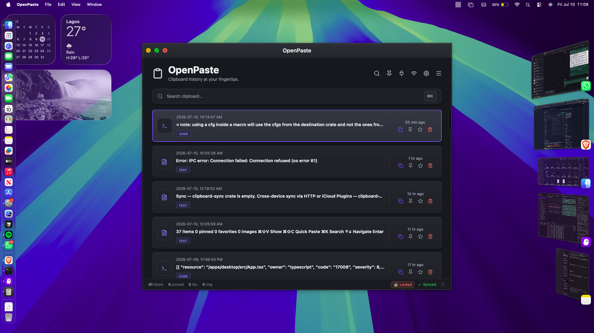
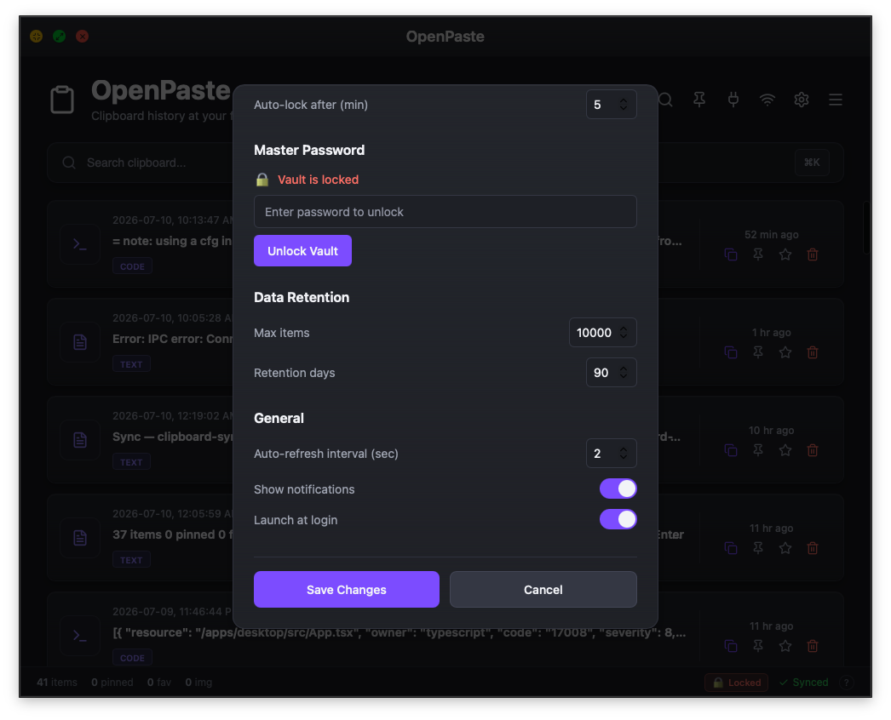

# OpenPaste

OpenPaste is a local-first, open-source clipboard manager for developers and power users. It captures everything you copy, keeps it searchable, encrypted, and organized — and stays entirely on your machine.

Built with **Tauri + React + Rust + SQLite**.





---

## Key Features

- **Unlimited clipboard history** — every copy is captured and stored locally with full-text search (FTS5)
- **AES-256-GCM encryption** — optional master password locks your vault; Argon2id key derivation
- **Auto-lock** — vault locks automatically after a configurable inactivity timeout
- **Tags** — organize items with color-coded tags; filter by tag from the sidebar
- **Pin & favorite** — surface important items instantly
- **WASM plugins** — extend clipboard processing with sandboxed WebAssembly modules
- **Cross-device sync** — optional HTTP sync to a self-hosted relay server
- **Global shortcuts** — `⌘⇧V` to show/hide, `⌘⇧C` to quick-paste the most recent item
- **System tray** — runs silently in the background
- **CLI** — full `openpaste` command-line interface for scripting and automation

---

## Installation

Download the correct package for your system from the latest [GitHub Releases](https://github.com/YOUR_USERNAME/openpaste/releases).

### 🖥️ macOS

1. **Download**:
   - **Apple Silicon (M1/M2/M3/M4):** `OpenPaste_x.x.x_aarch64.dmg`
   - **Intel Mac:** `OpenPaste_x.x.x_x64.dmg`

2. **Install:** Double-click the `.dmg` and drag **OpenPaste** to your Applications folder.

3. **First launch — bypass Gatekeeper** (unsigned build):
   - Right-click `OpenPaste.app` → **Open** → **Open** in the warning dialog.
   - Or run in Terminal:
     ```bash
     xattr -cr /Applications/OpenPaste.app
     ```

### 🪟 Windows

1. **Download:** `OpenPaste_x.x.x_x64-setup.exe` (installer) or `OpenPaste_x.x.x_x64.msi`
2. **Install:** Run the installer and follow the setup wizard.
3. **SmartScreen:** Click **More info → Run anyway** if Windows flags the unsigned build.

### 🐧 Linux

1. **Download:** `OpenPaste_x.x.x_amd64.deb` (Debian/Ubuntu) or `OpenPaste_x.x.x_amd64.AppImage` (universal)

2. **Install `.deb`:**
   ```bash
   sudo dpkg -i OpenPaste_*.deb
   ```

3. **Run `.AppImage`:**
   ```bash
   chmod +x OpenPaste_*.AppImage
   ./OpenPaste_*.AppImage
   ```

---

## CLI

The `openpaste` CLI talks to the running daemon over a Unix socket:

```bash
openpaste list             # Show clipboard history
openpaste search "query"   # Full-text search
openpaste copy <id>        # Copy an item back to the clipboard
openpaste get <id>         # Print item content to stdout
openpaste pin <id>         # Toggle pin
openpaste favorite <id>    # Toggle favorite
openpaste delete <id>      # Delete an item
openpaste status           # Check daemon connection
```

---

## Sync

OpenPaste supports optional push/pull sync via any server running the OpenPaste HTTP API. Open the Sync panel (wifi icon in the toolbar) and enter your server URL and optional bearer token.

To run your own relay server:

```bash
# Listens on 127.0.0.1:8080 by default
cargo run --bin clipboard-api

# Custom address
cargo run --bin clipboard-api -- --addr 0.0.0.0:8080

# Or via environment variable
OPENPASTE_API_ADDR=0.0.0.0:8080 cargo run --bin clipboard-api
```

The relay server reads from and writes to the same SQLite database as the daemon, so you can run both on the same machine or deploy the API server separately with its own database.

---

## Plugins

Plugins are WebAssembly modules that transform clipboard text on capture. Drop a `.wasm` file into:

- **macOS/Linux:** `~/.local/share/openpaste/plugins/` (or `~/Library/Application Support/openpaste/plugins/` on macOS)
- **Windows:** `%APPDATA%\openpaste\plugins\`

Or load one at runtime from the Plugins panel (plug icon in the toolbar).

**Plugin contract:**

```rust
// Export this function from your WASM module.
// Receives the clipboard text at memory[ptr..ptr+len].
// Write the transformed result back at ptr and return the new byte length.
// Return 0 to leave the content unchanged.
#[no_mangle]
pub extern "C" fn process_item(ptr: i32, len: i32) -> i32 { ... }

// Optional: the host provides this import for logging.
extern "C" { fn log(ptr: i32, len: i32); }
```

---

## Developer Guide

### Prerequisites

- Rust (stable, via [rustup](https://rustup.rs))
- Node.js 18+ and npm
- On Linux: `libgtk-3-dev`, `libwebkit2gtk-4.0-dev`, `libappindicator3-dev`, `librsvg2-dev`

### Development

Start the daemon and the desktop app in two terminals:

```bash
# Terminal 1 — daemon
cargo run --bin openpaste-daemon

# Terminal 2 — desktop (Tauri dev server with hot reload)
cd apps/desktop
npm install
npm run tauri:dev
```

The Tauri app will auto-detect a running daemon and skip spawning its own.

### Run tests

```bash
cargo test --workspace --exclude openpaste-desktop
```

### Build for release

```bash
cd apps/desktop
npm run tauri:build
```

Installers are placed in `apps/desktop/src-tauri/target/release/bundle/`.

### Project structure

```
openpaste/
├── apps/
│   ├── cli/                  # openpaste CLI binary
│   └── desktop/              # Tauri desktop app (React + Rust)
│       └── src-tauri/        # Tauri backend
└── crates/
    ├── clipboard-api/        # Axum HTTP sync server
    ├── clipboard-core/       # Core types and ClipboardManager
    ├── clipboard-daemon/     # Background daemon (IPC + clipboard polling)
    ├── clipboard-db/         # SQLite layer (sqlx)
    ├── clipboard-encryption/ # AES-256-GCM + Argon2id
    ├── clipboard-events/     # Tokio broadcast event bus
    ├── clipboard-ipc/        # Unix socket IPC (client + server)
    ├── clipboard-platform/   # Platform clipboard access (arboard)
    ├── clipboard-plugin/     # WASM plugin runner (wasmtime)
    └── clipboard-sync/       # HTTP sync client
```

---

## Releasing

Push a version tag to trigger the release workflow:

```bash
git tag v0.1.0
git push origin v0.1.0
```

GitHub Actions builds `.dmg` (arm64 + x64), `.exe`/`.msi`, `.deb`, and `.AppImage`, then creates a draft release. Review and publish from the GitHub Releases page.

---

## License

MIT
